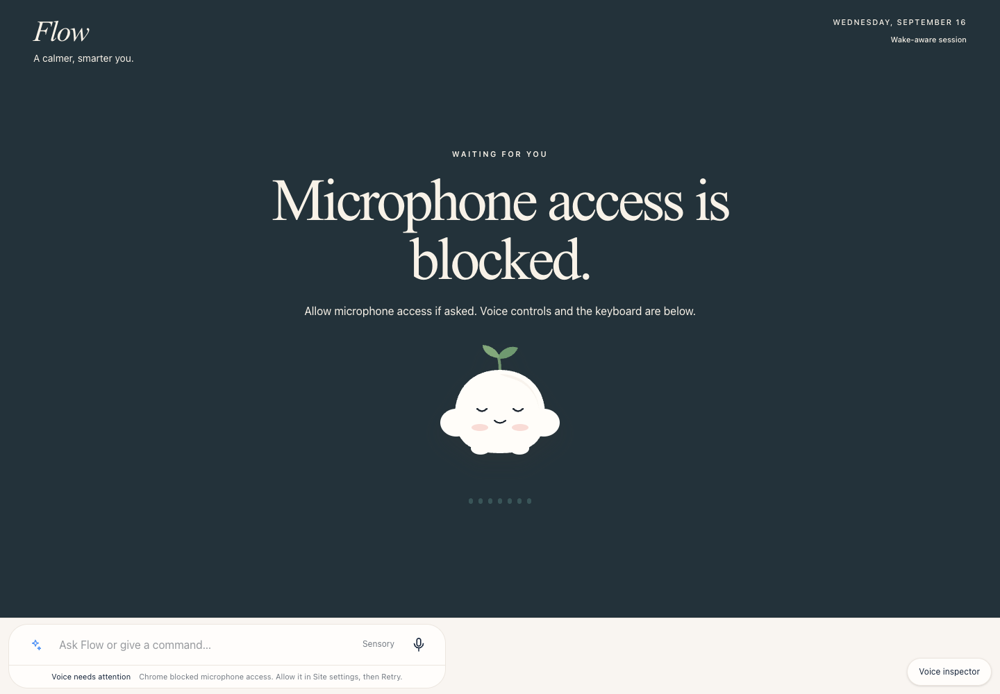
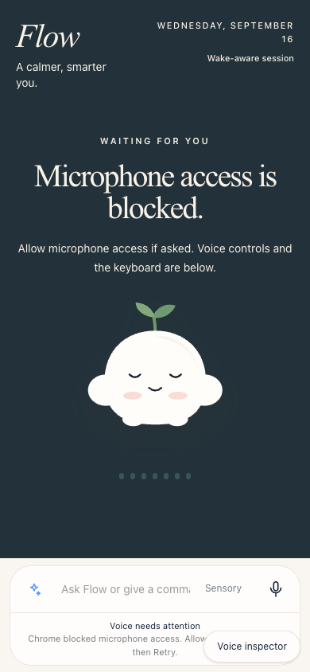

# Flow

**Voice-first personal computing where conversation directly changes calendars, journals, people, and memories.**

<p align="center">
  
</p>

## Conversation as interface

Flow is built around an active spoken loop rather than a command box. The user wakes the assistant, speaks naturally, receives spoken clarification when needed, and changes structured application state without repeatedly reaching for the screen.

<p align="center">
  
</p>

## Product surfaces

- **Calendar** — voice-created and voice-edited time blocks
- **Journal** — dictation and source-linked moments
- **Friends** — people connected across messages, plans and memories
- **Memories** — retained personal context and compositions

<details>
<summary>View more product captures</summary>

<p align="center">
  
</p>

<p align="center">
  
</p>

<p align="center">
  
</p>

<p align="center">
  
</p>

</details>

## Mobile

<p align="center">
  
</p>

## Engineering focus

- deterministic state underneath natural-language input
- accessible keyboard / visual fallbacks
- interruption, correction and cancellation
- contextual follow-up without repeating the wake word
- explicit confirmation for consequential actions
- visual reward without turning the app into a dashboard

## Run locally

```bash
npm ci
npm run dev
```

## Build

```bash
npm run build
```
