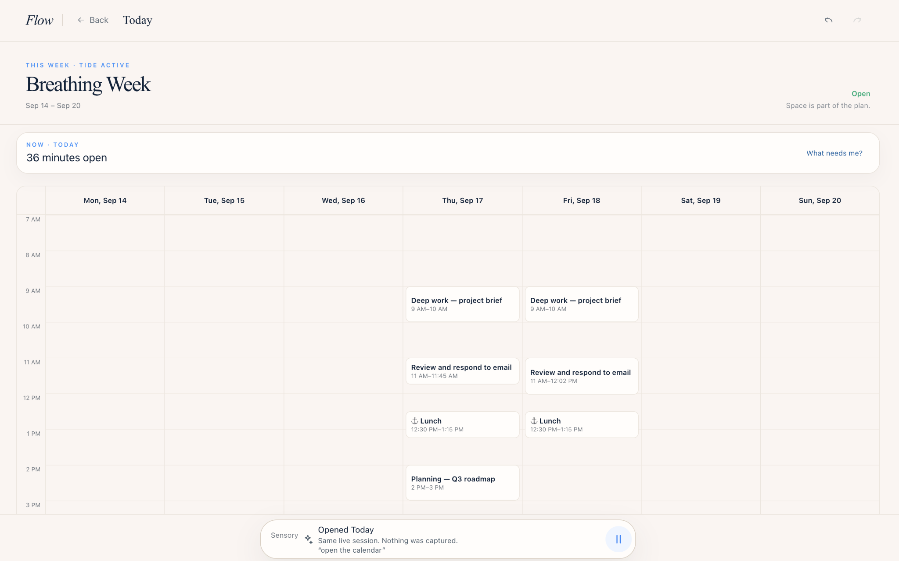
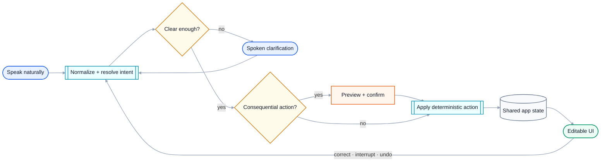
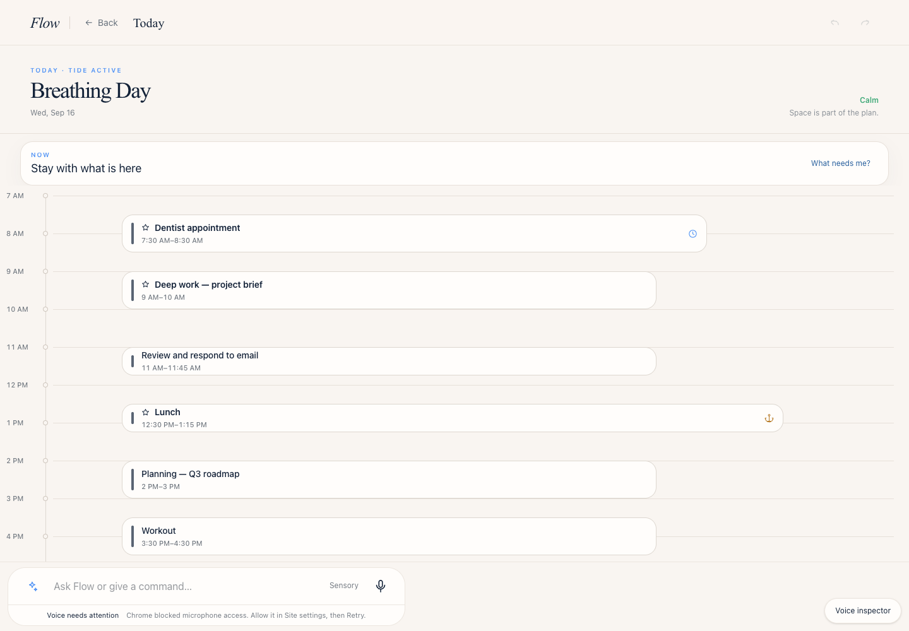
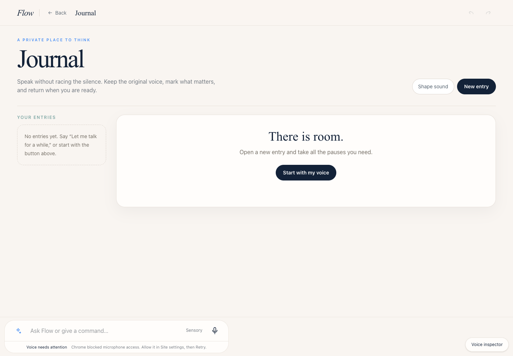
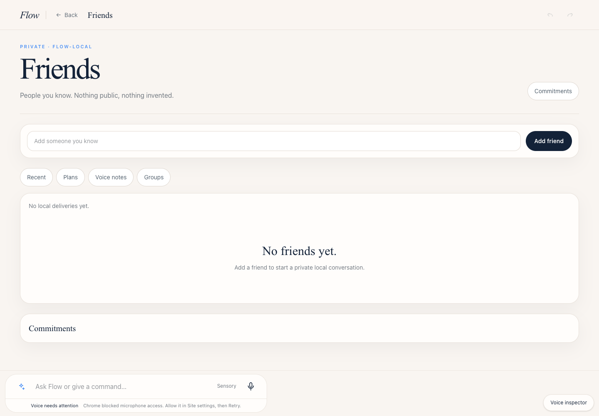
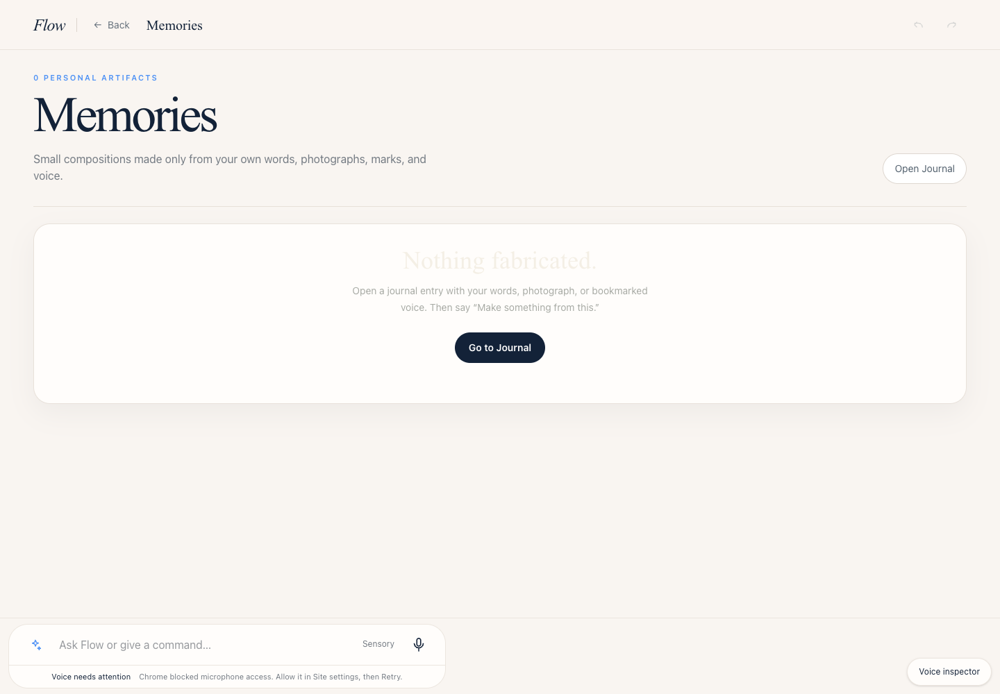
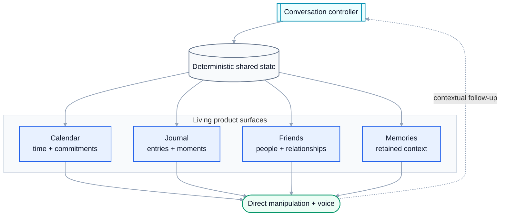

# Flow

**Voice-first personal computing where conversation directly changes calendars, journals, people, and memories.**

[Live demo ↗](https://miguelalmeida0.github.io/flow/) *(external — leaves GitHub)*

Flow is built around an active spoken loop rather than a command box. Spoken requests update structured application state, clarifications remain contextual, and the visual interface stays directly editable.

<p align="center">
  
</p>

<p align="center"><sub><strong>Breathing Week.</strong> A weekly calendar view where Flow preserves editable time blocks while voice remains part of the interaction model.</sub></p>

## Conversation loop



Natural language is only the input layer. Flow resolves intent, asks for clarification when needed, protects consequential actions, and applies changes to deterministic app state.

## Calendar

Voice-created and voice-edited time blocks remain directly manipulable on screen.

<p align="center">
  
</p>

## Journal

Dictation, retained prose, bookmarks, and source-linked moments stay inside the same product rather than opening a separate chatbot.

<p align="center">
  
</p>

## Friends

People are first-class entities connected to plans, messages, commitments, voice notes, and shared memories.

<p align="center">
  
</p>

## Memories

Personal context and retained moments stay connected to the rest of the system instead of living in an isolated archive.

<p align="center">
  
</p>

## Product model



- **Calendar** — create, move, rename, protect, defer and recover time by voice or direct manipulation
- **Journal** — dictation, entries, bookmarks and source-linked moments
- **Friends** — people connected across messages, plans, commitments and memories
- **Memories** — retained personal context and compositions
- **Voice loop** — clarification, confirmation, correction, interruption and cancellation without repeating the wake word

## Engineering focus

- deterministic state underneath natural-language input
- accessible keyboard and visual fallbacks
- contextual follow-up and recovery
- explicit confirmation for consequential actions
- responsive behavior across phone, tablet, laptop and wide desktop
- end-to-end verification of interaction state, not only screenshots

## Run locally

```bash
npm ci
npm run dev
```

## Build

```bash
npm run build
```
