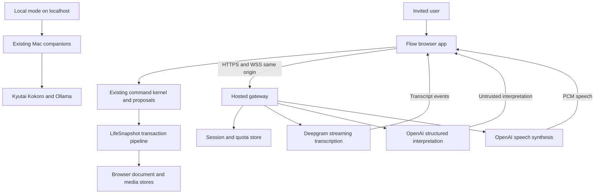
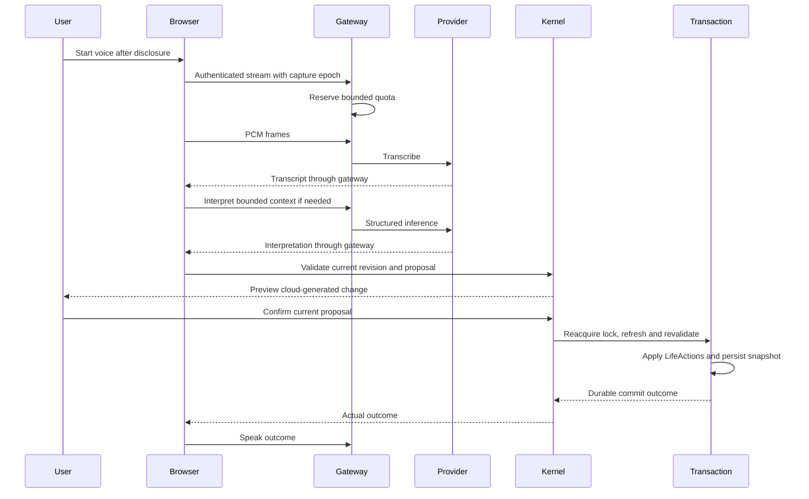
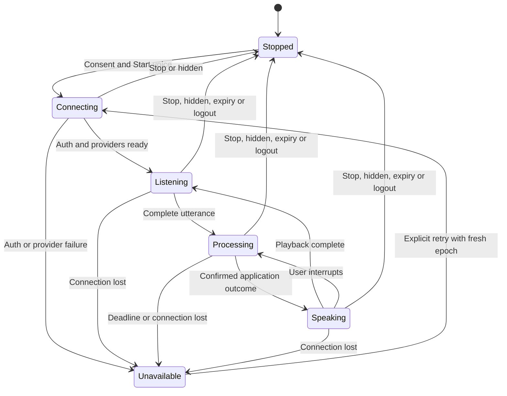

# Flow Public Deployment - Plan

## Goal Capsule

**Objective:** Let invited users open Flow over HTTPS, speak to it, make reliable changes to their calendar and journal, and retain those changes after reload without installing a Mac companion.

**Means:** Deploy the existing React application and a small inference gateway on one root origin. Keep the deterministic browser kernel and browser storage. Add managed speech and reasoning behind bounded, authenticated sessions.

**Release posture:** Target an invitation-only beta today, October 2, 2026. A same-day release is conditional on the gates below; preparation is not evidence that the product is ready. An unrestricted public launch is a later promotion of the same architecture.

**Authority:** The user's instructions govern scope. Product requirements govern behavior; technical decisions govern mechanisms. The current checkout is the source of truth. Preserve unrelated and uncommitted work. This document authorizes no infrastructure purchase, credential disclosure, publication, or merge by itself.

**Stop conditions:** Unintended mutation, lost persisted data, cross-session access, undisclosed audio transmission, unbounded paid inference, or failure of a release-critical journey prevents launch. If time expires, retain a private candidate and report the exact failed gate. A reduced demo release requires an explicit scope decision.

---

## Product Contract

### Summary

Ship Flow as a usable hosted beta with cloud voice and reasoning. Preserve its editable calendar, journal, people, memories, confirmations, cancellation, and undo. Retain the local Mac implementation as a separate runtime mode. Give users an explicit choice before cloud processing begins.

### Problem Frame

The current public demo predates the latest voice work. This checkout's speech and reasoning services run on loopback, and its desktop bridge can access local applications and files. Uploading the frontend cannot provide that infrastructure to visitors. Current CI also permits a large legacy failure baseline, so a green badge alone cannot establish release readiness.

### Planning assumptions

These are recommendations, not user-confirmed product decisions:

- Initial access: invited testers, with browser-local documents and media; no account synchronization.
- Cloud processing is acceptable after explicit consent. Existing local-only privacy claims apply only to local mode.
- Initial supported voice environment: desktop Chrome and Edge on macOS and Windows. Other browsers retain typed use until their voice paths are verified. Mobile voice support is deferred.
- Render is the proposed host; Deepgram and OpenAI are the proposed inference providers. Existing account access, billing, provider terms, and capacity are unverified.
- Provisional limits: 20 invites, five simultaneous voice sessions deployment-wide, one voice session per invite identity, five-minute voice sessions, 15 audio minutes and 100 model requests per identity per day. These are configuration defaults to review before enabling paid traffic.
- Proposed provider-spend ceiling: USD 10 per day, separate from hosting. This is a proposed authorization boundary, not a cost forecast or approval to spend.

Implementation can begin against these assumptions. Public traffic and paid inference remain disabled until the release owner confirms the scope, provider processing, and budget.

### Requirements

#### Product behavior

- R1. The hosted application must load at a dedicated HTTPS root origin, support direct route reloads, and require no local service for supported web capabilities.
- R2. Typed input, direct editing, and voice must reach the same deterministic command and persistence path.
- R3. Model output is an untrusted proposal; cloud-generated mutations require review and explicit confirmation for the beta, including when semantic verification is unavailable.
- R4. Confirmation must refer to the current proposal and document revision; cancellation, expiry, supersession, or state changes invalidate its authority.
- R5. Successful mutation feedback must follow successful application and persistence; duplicate transport events must not create duplicate changes.
- R6. Provider failure must preserve typed use and existing data, with an accurate unavailable state.

#### Voice and data

- R7. Hosted voice starts only after an explicit user action and cloud-processing disclosure; stopping or hiding the page releases microphone tracks and ends upload.
- R8. Active hosted sessions must visibly indicate cloud listening, permit interruption, and keep exactly one capture, transcript-dispatch, and speech-output owner.
- R9. Browser-local documents and media remain local at rest; inference receives only the disclosed, bounded context needed for the request.
- R10. A new origin starts with a separate browser store. The release must retain access to the old origin and explain this boundary without claiming migration or synchronization.
- R11. Local mode remains available through the existing localhost workflow; no automatic cloud fallback or automatic probing of a public visitor's desktop services is allowed.

#### Release operation

- R12. Hosted inference requires a revocable server-issued session, bounded resource use, and enforceable deployment-wide limits.
- R13. Desktop actions are unavailable in hosted mode across UI, prompt construction, output validation, and kernel execution.
- R14. Launch requires an identified immutable candidate, strict release-specific checks, live provider evidence, and a rehearsed rollback.

### Acceptance examples

- AE1. **Covers R2, R5:** “Move my dentist appointment to tomorrow at four” resolves the intended event, updates it once, survives reload, and can be undone.
- AE2. **Covers R3, R4:** A cloud-generated change is previewed. Editing the event before saying “confirm” makes the old proposal unusable and requests a fresh review.
- AE3. **Covers R7, R8:** Before Start voice, the browser sends no audio. Stop, tab hiding, logout, and session expiry end capture and upstream traffic. Showing the tab does not resume capture automatically.
- AE4. **Covers R5, R6:** Disconnecting after a final transcript cannot replay the mutation on reconnect. A deliberate new repetition remains a new intent.
- AE5. **Covers R9, R10:** Journal text and saved media reopen on the same origin. Opening the new host does not silently erase or pretend to import the old site's data.
- AE6. **Covers R12, R13:** One tester cannot receive or cancel another tester's voice stream. A generated `desktop.openFile` request is rejected even if supplied directly to the kernel boundary.

### Scope boundaries

The beta covers existing browser capabilities, hosted inference, explicit voice activation, failure recovery, access limits, and deployment operations. It does not imply real external calendar synchronization, message delivery, or remote control of a user's computer.

**Deferred to follow-up work:** open anonymous AI access, accounts and cloud sync, automatic cross-origin data migration, Mac installer/pairing redesign, mobile voice certification, new product surfaces, distributed agents, and latency optimizations beyond the release gate. Existing local microphone/model tests remain local evidence.

---

## Planning Contract

### Verified starting point

| Surface | Evidence available on October 2 | Consequence |
|---|---|---|
| Checkout | `feat/voice-latency-fluidity-v1`, HEAD `114fd9d`, substantial tracked and untracked changes | Snapshot the actual working tree before assembling a candidate; HEAD alone does not identify it |
| Build | Earlier in this conversation: TypeScript failure in `streamingWake.ts` repaired; normal and `/flow/` builds passed | Build blocker removed; hosted behavior remains unverified |
| Focused checks | Earlier in this conversation: lint passed; 49 tests passed in wake, companion-client, and voice-hook suites | Scoped evidence only; no full-suite claim |
| Public site | GitHub Pages HTTP 200; `gh-pages` commit `e47028b`, September 17 | Keep the existing deployment available until replacement passes |
| CI proposal | [Run 36990095447](https://github.com/miguelalmeida0/flow/actions/runs/36990095447), commit `e59373f6`: 4,525 unit passes / 463 failures; 73 browser passes / 50 failures / 8 did not run; deep evidence skipped | Actual results from the CI branch, not this dirty checkout; the baseline pass is not launch approval |
| Routing/assets | `FlowEnvironmentProvider.tsx` writes root paths; `voiceMicCapture.ts` loads `/voice-pcm-worklet.js` | Use a root origin; `/flow/` build success is insufficient |
| State | `src/domain/life-storage.ts`: `flow.life.v3`; `src/features/studio/mediaRepository.ts`: IndexedDB | Origin changes do not migrate existing state |
| Voice | `isMicActive()` includes `SLEEPING`; dock can auto-start browser recognition | A hosted transport requires capture and ownership changes |
| Inference | `modelClient.ts` uses desktop `/capability`; coordinator can execute before returning | Isolate transport and enforce freshness before execution |

These are source and prior-turn observations. No production code changes or new test executions are part of this planning pass. Remote CI and provider status must be refreshed when execution begins.

The largest unit cohort is `src/features/voice-intelligence/productionPipelineEvaluator.test.ts` with 330 failures; investigate common causes before treating each failure as a separate defect. Browser examples include obsolete `Start Flow Live` selectors, live Open-Meteo aborts, weather-enriched state comparisons, and a missing historical Studio image fixture. Other failures concern Journal text, route identity, and control overlap. Update a fixture only after establishing the supported behavior; do not broadly suppress request errors or weaken state assertions. The latest local voice PASS covers one wake scenario, and its safety counters are null. It cannot stand in for hosted release evidence.

### Key technical decisions

- KTD1. **One public Node service, one origin.** Serve Vite's `dist` and host `/api/*` plus `/voice` in a new `server/hosted-gateway/`. Use a paid Render web service, a supported Node LTS, explicit SPA fallback, and the platform port. This removes cross-origin cookie/CORS coordination and avoids a simultaneous Pages basename repair. Existing desktop bridge code is not imported. Governs R1, R11, R13. [Render web services](https://render.com/docs/web-services)

- KTD2. **Managed speech; existing PCM boundary.** Use Deepgram Nova-3 streaming STT with explicit linear16 mono 24 kHz configuration and interim results. Accumulate finalized segments before emitting a Flow utterance final; a segment final is not an utterance end. Map events into a provider-neutral version of the existing voice contract. Start with a 700 ms command pause threshold, then qualify the existing 200–1500 ms pause fixtures; dictation has its own segmentation and explicit save boundary. Use OpenAI `gpt-4o-mini-tts` streamed PCM16LE at 24 kHz for speech generated from application outcomes. These are candidates to validate, not measured winners. Governs R2, R5, R8. [Deepgram endpointing](https://developers.deepgram.com/docs/understand-endpointing-interim-results), [audio encoding](https://developers.deepgram.com/docs/encoding), [sample rate](https://developers.deepgram.com/docs/sample-rate), [OpenAI speech format](https://developers.openai.com/api/docs/guides/text-to-speech)

- KTD3. **A narrow reasoning adapter.** Keep `ModelCallOutcome`, the coordinator, schema validation, and deterministic execution. Route cloud requests through a bounded interpretation endpoint using a server-owned prompt/schema and pinned `gpt-4.1-mini-2025-04-14` as the initial corpus candidate. Map refusals, incomplete outputs, and provider errors explicitly. Strict JSON formatting does not replace semantic checks. Adapt the existing schema to the provider's supported subset without weakening the internal validator. Governs R2–R6. [Model capabilities](https://developers.openai.com/api/docs/models/gpt-4.1-mini), [Structured Outputs](https://developers.openai.com/api/docs/guides/structured-outputs)

- KTD4. **The browser kernel decides; the LifeSnapshot transaction commits.** Define one runtime capability policy used by registry construction, prompts, validation, and execution. Hosted mode excludes desktop capabilities. Each asynchronous turn binds session, capture epoch, turn ID, proposal ID where applicable, and document revision. Capture context under a short document lock, release it during inference, then reacquire it to refresh persisted state and revalidate authority before execution. Preserve `FlowEnvironmentProvider`'s `commit`/`persistSnapshot` pipeline as the durable owner, reached through `productionBridge` and `dispatchLife`. Await its persistence outcome before publishing mutation success or finalizing completion/idempotency state. Revalidate confirmation with a proposed 60-second authority lifetime. Governs R3–R5, R13.

- KTD5. **Explicit modes and cloud sessions.** Select `hosted`, `local`, or `typed-only` at startup. Hosted mode ignores stored local companion credentials and disables the dock's automatic browser recognizer. Within an activated session, hands-free wake and follow-up behavior may continue, but all captured audio is cloud processing and must be described that way. Hidden pages stop immediately. Recovering a socket never replays captured audio or automatically restores an uncertain utterance. Governs R7, R8, R11.

- KTD6. **Access and quotas in shared storage.** Use private Render Key Value with persistence, internal authentication, and `noeviction`. Store hashes of high-entropy per-tester invite credentials and opaque sessions; never store audio, prompts, or documents there. Issue a `Secure`, `HttpOnly`, `SameSite=Strict` cookie after redemption. Enforce exact Origin checks on state-changing HTTP and WS upgrades, CSRF protection on mutations, session expiry/revocation, and atomic quota reservations. Bind cancellation and stream ownership to authenticated identity. Key Value loss or uncertainty disables inference rather than resetting quotas. Governs R9, R12. [Render Key Value](https://render.com/docs/key-value)

- KTD7. **Bound work before it becomes billable.** Enforce the provisional limits above on the server. Add per-request byte, token, audio-duration, queue, and deadline bounds. Reserve worst-case allowed work atomically against one durable parent daily budget and each environment's sublimit before provider calls; account for verifier calls, TTS, silence, and concurrent sessions. Spikes, corpus runs, health probes, staging, CI, and production all use this ledger through the budgeted gateway. Separate identity/session namespaces do not create separate spending authorizations. Retain uncertain reservations until reconciled. A provider cancellation is not proof of zero cost. Keys, endpoint targets, model selection, and maximum output size are server-owned. A kill switch stops active streams and refuses new paid work. Governs R12.

- KTD8. **Keep data in the browser; minimize inference context.** Preserve the current four-turn history limit and bounded referent/lookup context. Validate structured request fields and impose a 64 KiB interpretation body cap, with a stricter model token cap derived from the approved budget. Use no semantic response cache, no content in logs, and `store:false` where supported. Set `mip_opt_out=true` on every Deepgram request and verify the flag in provider request metadata. Provider retention and training settings require account-level verification; do not promise zero retention or EU-only processing from an EU host choice. Governs R9, R10. [OpenAI data controls](https://developers.openai.com/api/docs/guides/your-data), [Deepgram data controls](https://developers.deepgram.com/trust-security/your-data)

- KTD9. **Strict release checks beside legacy debt.** Preserve the full suite and its failure output. Identify allowed legacy failures by exact test identity, cause, owner, and expiry rather than aggregate counts. New tests, auth/isolation, persistence, confirmation, and release journeys must pass without retries or skips. A failure in any reachable release-critical path blocks launch even if inherited. Governs R14.

- KTD10. **Deploy by immutable candidate and recover explicitly.** Freeze source, dependency locks, config version, provider/model versions, test report, and artifact digest together. Package the gateway and Vite output once as a `linux/amd64` container from the isolated candidate; publish it to a private GitHub Container Registry package and deploy its digest to staging and production without rebuilding. Keep runtime configuration versioned separately and expose the running release ID. Retain tested and rollback digests in the registry. Manual promotion follows staging evidence; auto-deploy is disabled during launch. Drain WS connections on shutdown and require a fresh capture epoch after reconnect. Do not attach a persistent application disk. Governs R6, R14. [Render prebuilt images](https://render.com/docs/deploying-an-image), [Render WebSockets](https://render.com/docs/websocket), [Render deploys](https://render.com/docs/deploys)

### High-level technical design

The diagram describes transport lifecycle. Existing proposal/confirmation state remains in the kernel; reconnect cannot recreate approval authority.

### Protocol and operational boundaries

| Boundary | Contract |
|---|---|
| Browser bootstrap | Public runtime configuration contains modes and available features, never secrets; default cloud access is off until configured |
| Session redemption | High-entropy invite exchanged once for revocable authenticated access; throttled failures. Logout, cookie loss, or auth expiry offers operator-assisted credential replacement for the same identity and usage ledger, revoking the previous credential. Invitation is access control, not a synchronized account |
| Voice session expiry | Five-minute voice sessions are separate from authenticated access; explicit Start opens another session if authentication and remaining quotas allow. Neither reconnect nor credential replacement resets usage |
| Voice WebSocket | Versioned handshake; capture epoch and ordered turn identity; one connection per identity; no process-global user ownership |
| Audio buffering | PCM16LE mono 24 kHz; preserve odd-byte chunk tails; cap buffered audio to two seconds; overflow stops the stream with visible recovery instead of dropping speech silently |
| Transcript finalization | Preserve segment order, reject duplicate/stale epochs, finalize each utterance once; partials cannot authorize changes |
| TTS cancellation | Abort provider request, increment output generation, clear browser playback, discard late chunks from the cancelled generation |
| Model endpoint | Typed input/context plus contract version; server chooses prompt/schema/model; reject arbitrary URLs, tools, raw system prompts, or caller-selected schemas |
| HTTP cancellation | Browser AbortSignal reaches fetch; server disconnect/deadline reaches provider; timeout races cannot leave unrestricted jobs running |
| Persistence | Browser storage failure retains unsaved content with a visible Retry save action and warning before leaving; retry may report success only after durable persistence |
| Health | Application readiness verifies static/typed serving independently of inference. Invalid inference configuration or unavailable quota storage disables paid endpoints without making stored documents inaccessible. Provider health is a separate budgeted probe, not a paid call on every health poll |
| Observability | Request/turn IDs, provider/model version, timings, usage reservations, result class, disconnect reason; content and cookie/query credentials redacted |

For shutdown, stop admitting new streams, invalidate in-flight speech authority, abort provider work, and close sockets with a restart reason within the platform drain window. A reconnect can land on another instance. Session and quota state is shared; raw audio and incomplete utterances are not resumed.

### Alternatives considered

| Approach | Decision |
|---|---|
| Publish only the latest Pages bundle | Useful for a separately scoped demo; it does not provide hosted inference and still needs basename fixes |
| Tunnel the Mac companions to the internet | Rejected: desktop capability exposure, local uptime, shared process ownership, and local-model capacity |
| Move MLX workers to ordinary Linux hosting | Rejected for today: current workers depend on Apple's MLX runtime; this would be a model/runtime port |
| Direct browser-to-provider voice | Deferred: removes a relay hop but introduces another credential, quota, and media lifecycle while Flow's existing PCM adapter remains reusable |
| Full speech-to-speech agent replacing the kernel | Rejected: would move action authority and confirmation semantics away from the existing validated application path |
| One-provider OpenAI transcription | Viable later; current live transcription documentation requires client-managed turn commitment. Nova-3's segment and endpoint events fit this release with less new endpointing infrastructure. [Realtime transcription](https://developers.openai.com/api/docs/guides/realtime-transcription) |

---

## Implementation Units

| Unit | Deliverable | Primary paths | Depends on |
|---|---|---|---|
| U1 | Candidate and failure inventory | `docs/quality/hosted-release-baseline.md` | None |
| U10 | Early application repairs | Defect paths identified by U1 | U1 |
| U2 | Runtime/provider boundaries | `src/app/runtimeMode.ts`, capability registry | U1 |
| U3 | Hosted gateway and access | `server/hosted-gateway/` | U1, U2 contract |
| U4 | Hosted speech | Voice clients/hook and provider adapters | U2, U3; U8 staging for live spike; relevant U10 repairs and U9 commit boundary |
| U9 | Durable transaction authority | Provider, synchronization, kernel bridge | U1, U2 |
| U5 | Hosted reasoning | Model client/coordinator and provider adapter | U2, U3, U9; relevant U10 repairs |
| U6 | Activation and recovery UX | Dock, consent, hosted onboarding | U2; integrate U4, U5, U9 |
| U8 staging phase | Build image and prepare protected staging | Dockerfile, registry, `render.yaml`, hosted runbook | U1, U3; approved hosting/registry/budget inputs |
| U7 | Strict release CI | Workflow and release gates | U1–U6, U9, U10; U8 staging |
| U8 promotion phase | Promote tested digest and observe | Deployment config and release record | U7; approved launch inputs |

### U1. Establish a reproducible release candidate and failure inventory

**Goal:** Identify precisely what is being released and which failures matter. **Requirements:** R14. **Dependencies:** none.

**Files:** `docs/quality/VERIFICATION.md`, proposed `docs/quality/hosted-release-baseline.md`, `.github/workflows/ci.yml`; evidence under `artifacts/hosted-release/<candidate-id>/`.

**Approach:** Preserve the dirty working tree and record tracked/untracked source hashes. Assemble an isolated source snapshot containing the reviewed tracked and untracked release files; exclude secrets, caches, and unrelated work. Use that snapshot as U8's container build context and record its manifest digest; HEAD alone is insufficient. Reconcile the cited CI run and other in-flight CI proposals discovered at execution start with the candidate, recording each run ID and commit without switching or resetting this checkout. Obtain full raw suite results and classify each failure as product defect, outdated expectation, infrastructure failure, or unresolved. Flag release-critical failures regardless of age.

**Test scenarios:** Reproduce failing calendar, journal, confirmation, ownership, and storage cases from the actual candidate; record exact assertion and failure identity. No new tests merely to mirror the inventory.

**Verification:** One candidate manifest ties source, dependencies, dirty changes, and raw reports together. Every critical failure has an owner and next discriminating check.

### U10. Repair confirmed release-critical application failures early

**Goal:** Establish correct calendar, journal, confirmation, and persistence behavior before attaching new providers. **Requirements:** R2–R6, R14. **Dependencies:** U1.

**Files:** Defect-specific source paths identified by the reproduced U1 inventory; existing `src/features/voice-intelligence/productionPipelineEvaluator.test.ts`, `src/app/FlowCalendarPreservation.test.tsx`, `src/app/FlowVoiceControlRebuild.test.tsx`, and affected browser specs only where evidence points to them.

**Approach:** Start with one representative failure per shared cause. Repair production defects with focused regression proof. Correct stale selectors, missing fixture assumptions, and uncontrolled weather inputs only after checking intended behavior. Coordinate transaction-related changes with U9's owner. This lane starts alongside gateway preparation, not during final release verification.

**Test scenarios:** Each corrected cohort must preserve intended target identity, document/history deltas, journal content, and confirmation/cancel behavior; repeat affected journeys through typed and voice entry paths where relevant.

**Verification:** Reproduced release-critical failures pass on the repaired application before the corresponding hosted vertical slice is accepted. Remaining unresolved critical cohorts keep launch blocked.

### U2. Introduce runtime mode and provider boundaries

**Goal:** Make local and hosted capabilities explicit without rewriting the command engine. **Requirements:** R1, R2, R11, R13. **Dependencies:** U1.

**Files:** `src/kernel/llm/modelClient.ts`, `src/kernel/voice/voiceCompanionClient.ts`, `src/kernel/voice/voiceOwnership.ts`, `src/kernel/capabilities/index.ts`, `src/kernel/llm/capabilityModel.ts`, `src/kernel/llm/validateModelOutput.ts`, `src/shared/command/GlobalCommandDock.tsx`, proposed `src/app/runtimeMode.ts`, `src/app/runtimeMode.test.ts`, `src/kernel/voice/voiceTransport.ts`, and existing ownership/validation tests.

**Approach:** Extract narrow provider contracts at existing seams. Apply KTD4–KTD5 consistently to recognition, TTS, prompts, and execution. Retain local-mode behavior and provider-specific error mapping. Avoid a general plugin framework.

**Test scenarios:**

- Hosted mode with stale localStorage companion tokens never contacts loopback.
- A malicious hosted result containing a desktop capability is rejected at validation and execution.
- Provider switch/disconnect leaves one microphone, dispatcher, and speech-output owner.
- Local mode still uses the existing companions; typed-only mode starts no recognizer.

**Verification:** Mode/capability tests and existing local voice tests pass; the shared coordinator remains the only reasoning execution path.

### U3. Build the bounded hosted gateway

**Goal:** Expose inference infrastructure with session isolation and enforceable limits. **Requirements:** R9, R12, R13. **Dependencies:** U1; API contract agreed with U2.

**Files:** proposed `server/hosted-gateway/index.mjs`, `auth.mjs`, `quotas.mjs`, `config.mjs`, `index.test.mjs`, `auth.test.mjs`, `quotas.test.mjs`, `package.json`, `vitest.server.config.ts`.

**Approach:** Implement KTD1, KTD6–KTD8. Serve only `dist` and explicit API paths. Use maintained HTTP, WS, and Redis clients; pin dependencies. Keep invite redemption and control state outside application document storage. Missing or invalid inference secrets, model, budget, or quota-store configuration disables inference endpoints while allowing the static app and deterministic typed capabilities to start. Application readiness must support that degraded mode.

**Test scenarios:**

- Missing, expired, revoked, forged, or cross-origin credentials cannot open a provider session.
- Identity A cannot cancel, replace, or read identity B's request or stream.
- Concurrent requests atomically reserve limits; restart and Redis failure cannot reset or bypass the spend cap.
- Concurrent staging, CI, and production requests cannot exceed the shared parent cap; direct unbudgeted provider calls are unavailable to live harnesses.
- Starting with inference disabled or its configuration incomplete still serves existing browser data and deterministic typed journeys.
- Oversized messages, invalid PCM, slow clients, and queue overflow terminate bounded work without crashing other sessions.
- Requests for `.env`, repository files, desktop endpoints, and unknown API paths return no sensitive content.

**Verification:** Server integration tests cover real shared quota-store concurrency; provider calls remain stubbed in deterministic tests. No secrets appear in built assets, logs, or errors.

### U4. Integrate hosted speech with Flow's real audio path

**Goal:** Carry browser audio through hosted STT and outcome-driven TTS. **Requirements:** R2, R5–R8. **Dependencies:** U2, U3; U8 staging for the live spike; corresponding application-journey acceptance requires U10 repairs and U9's commit boundary.

**Files:** proposed `server/hosted-gateway/providers/deepgram-stt.mjs`, `openai-tts.mjs`, corresponding `*.test.mjs`, `src/kernel/voice/hostedVoiceClient.ts`, `hostedVoiceClient.test.ts`; existing `useKyutaiVoiceSession.ts` and tests, `voiceSessionMachine.ts` and tests, `voiceMicCapture.ts`, `voiceTtsPlayer.ts` and tests; proposed `e2e/hosted-voice.spec.ts` and `scripts/voice-autopilot/hosted.mjs`.

**Approach:** Reuse the existing AudioWorklet, wake/echo logic, utterance authority, and PCM player through U2's interface. Implement KTD2 and the protocol table. Stop capture on page hiding and handle TTS interruption at both gateway and playback. Mark readiness only after the actual provider connection/configuration is accepted.

**Execution note:** Prove one real synthetic-audio → transcript → calendar change → spoken outcome on a protected candidate before broadening features. This spike is an early go/no-go check, not a release pass.

**Test scenarios:**

- Native fake microphone exercises getUserMedia → worklet → gateway → real STT; no injected transcript counts as this evidence.
- Multi-segment utterances, punctuation, repeated finals, 200–1500 ms pauses, dictation save, and reconnect preserve exact intended content.
- Stop/hidden/expiry sends zero subsequent audio; late events cannot mutate or restart playback.
- Barge-in clears audible playback and upstream generation; old PCM cannot re-enter the current generation.
- Two identities speak concurrently without transcript, TTS, or ownership crossover.

**Verification:** Deterministic adapter tests pass; real-provider browser evidence records model/version and correlated timings. Physical room acoustics remain a separate unmeasured claim unless actually tested.

### U9. Preserve durable commits across asynchronous inference

**Goal:** Make stale work harmless and successful feedback depend on durable state. **Requirements:** R4, R5, R6. **Dependencies:** U1, U2; coordinate with U10.

**Files:** `src/app/FlowEnvironmentProvider.tsx`, `src/domain/life-synchronization.ts`, `src/kernel/productionBridge.ts`, `src/kernel/kernel.ts`, `src/kernel/proposals.ts`, existing `src/app/FlowConversationalSupersession.test.tsx`, `src/domain/life-storage.test.ts`, `src/kernel/__tests__/productionBridge.test.ts`, and proposed `src/app/FlowDurableCommit.test.tsx`.

**Approach:** Implement KTD4 as one transaction boundary. Avoid holding the document Web Lock across remote calls. Treat kernel mutation/session changes as tentative until translated LifeActions persist. On failure, retain retryable content and prevent completion/idempotency bookkeeping from suppressing the retry. Keep undo/history semantics inside the existing LifeSnapshot pipeline.

**Test scenarios:**

- A typed edit submitted during inference commits without waiting for the provider and invalidates the older cloud result.
- A second tab writes before confirmation; the refreshed revision rejects the stale proposal.
- Storage quota failure produces no success speech or completed trace and leaves a visible retryable draft.
- Retrying after storage recovery commits exactly once with the correct undo history.

**Verification:** Tests assert actual persisted snapshots and feedback order, including failure paths; no lock is held during provider latency.

### U5. Add cloud interpretation and close stale-authority gaps

**Goal:** Preserve safe application semantics across network latency and model uncertainty. **Requirements:** R2–R6, R13. **Dependencies:** U2, U3, U9; corresponding acceptance requires U10 repairs.

**Files:** proposed `src/kernel/llm/cloudModelClient.ts`, `cloudModelClient.test.ts`, `server/hosted-gateway/providers/openai-model.mjs` and tests, `src/kernel/llm/acceptanceCorpus.cloud.test.ts`; existing `conversationCoordinator.ts`, `verifier.ts`, `promptBuilder.ts`, `outputSchema.ts`, `kernel.ts`, `proposals.ts`, `FlowEnvironmentProvider.tsx`, corresponding coordinator/verifier/proposal tests and `src/app/FlowConversationalSupersession.test.tsx`.

**Approach:** Implement KTD3 through U9's transaction boundary and propagate cancellation through every timeout. Route cloud-generated changes to review under R3; validate capability arguments and proposal authority again on confirmation. Preserve deterministic commands' existing behavior.

**Test scenarios:**

- Provider refusal, malformed output, unknown entity, truncated JSON, and verifier outage never produce automatic mutation.
- Editing a document, a cross-tab update, new utterance, logout, or mode switch during inference invalidates the old turn before execution.
- Expired/replaced/duplicated approvals cannot execute; a current approval applies once.
- Hypothetical, negated, and compound requests preserve exclusions; quoted journal text never becomes a command.
- Duplicate delivery is ignored, while deliberate repeat and undo-then-repeat work as new actions.
- Cloud and local interpretation of representative corpus cases produce equivalent approved document outcomes.

**Verification:** Strict boundary tests pass and the pinned cloud model passes the selected acceptance corpus with raw outcomes preserved. Model speech cannot claim mutation success independently of persistence.

### U6. Provide honest activation, failure, and storage UX

**Goal:** Make cloud behavior understandable and controllable. **Requirements:** R6–R11. **Dependencies:** U2; integrate U4, U5, and U9.

**Files:** `src/shared/command/GlobalCommandDock.tsx`, `src/app/FlowEnvironmentProvider.tsx`, proposed `src/features/voice/CloudVoiceConsent.tsx` and test, `src/app/HostedRuntime.test.tsx`, `e2e/hosted-onboarding.spec.ts`, `README.md`, proposed `docs/engineering/HOSTED_FLOW.md`.

**Approach:** Add compact first-use disclosure, Start/Stop, active cloud-listening state, remaining session time, and clear recovery. Show that browser data is device/origin-specific. Keep the prior Pages URL accessible and labelled as the previous version; do not redirect users away from their old store. State that speech is AI-generated. Replace local-only setup instructions in hosted error states.

**Test scenarios:**

- Denied microphone permission and provider outage leave every supported typed journey usable.
- Voice-session expiry permits explicit restart within the remaining allowance. Logout/auth expiry offers credential replacement for the same identity; reentry preserves browser data and never resets quota. Exhausted allowance remains unavailable with its cause shown.
- Keyboard and screen-reader users can start, stop, review, confirm, cancel, and recover focus.
- Refresh/reopen retains journal text and saved media on the new origin; storage failure preserves the unsaved draft, offers Retry save, and warns before leaving.
- New origin shows no fabricated imported data and links to the prior deployment.
- No UI state named asleep/stopped continues uploading ambient sound.

**Verification:** Onboarding and persistence journeys pass at desktop and narrow viewports; privacy copy matches actual network activity and verified provider settings.

### U7. Establish release-specific CI and verify the combined candidate

**Goal:** Make the release decision independent of permissive aggregate baselines. **Requirements:** R14 and all applicable acceptance examples. **Dependencies:** U1–U6, U9, U10; U8 staging phase.

**Files:** `.github/workflows/ci.yml`, proposed `.github/workflows/hosted-release.yml`, `scripts/ci-release-gate.mjs`, `scripts/ci-release-gate.test.mjs`, `docs/quality/hosted-release-baseline.md`, `playwright.config.ts`, `e2e/hosted-release.spec.ts`; defect-specific production/tests identified in U1.

**Approach:** Implement KTD9. Run full lint/type/unit/server/build checks and preserve the complete browser suite result. Add a strict hosted lane with zero failures/skips/retries. Any allowed noncritical legacy failure must match an explicit record; a new failure cannot hide behind a reduction elsewhere. Secrets-bearing live-provider checks run only on trusted release candidates, with protected credentials and a bounded spend allotment.

**Test scenarios:**

- One new failure plus one fixed old failure still rejects the candidate.
- Missing tests, skipped critical tests, missing reports, and unfinished jobs fail closed.
- Every AE runs on the frozen hosted candidate, including storage, actual model refusal, and gateway restart.
- Release artifacts identify the exact source and config that generated them.

**Verification:** The release matrix below is complete. Any residual noncritical failure has an evidence-backed disposition; critical failures are repaired and replayed.

### U8. Provision, promote, observe, and rehearse rollback

**Goal:** Prepare staging early, then operate the verified candidate at a stable URL. **Requirements:** R1, R6, R12, R14. **Dependencies:** staging phase needs U1, U3 and approved hosting/registry/budget inputs; promotion phase needs U7 and confirmed launch inputs.

**Files:** proposed `Dockerfile.hosted`, `.dockerignore`, `scripts/build-hosted-image.mjs`, `render.yaml`, `.env.hosted.example`, `docs/engineering/HOSTED_FLOW.md`, `docs/quality/hosted-release-record.md`, release manifest generated under `artifacts/hosted-release/<candidate-id>/`.

**Staging phase:** Describe the web service and private quota store declaratively. Build U1's isolated snapshot into the KTD10 container, publish to the approved private registry, and deploy by digest. Give Render pull-only credentials. Prepare invitation-protected staging before U4's live spike; unknown identities cannot access inference. Use separate staging/production secrets and identity/session namespaces with environment sublimits under KTD7's single parent budget. Each changed source candidate produces a new digest and invalidates affected evidence.

**Promotion phase:** After U7 passes on staging, deploy that exact digest to the final origin with versioned production configuration, initially limited to the operator. Verify running release identity and production smoke checks before admitting testers. Gate application readiness independently of inference, and retain a rollback target. Record provider controls, approved hosting cost, total daily cap and sublimits, canonical URL, and operator. Staging G1–G8 evidence permits operator-only promotion; production smoke and rollback verification complete the public release record.

**Test scenarios:**

- Direct `/journal` and nested person routes return the app; missing assets/API routes do not return HTML success.
- JS, CSS, and AudioWorklet load from the public root origin with correct MIME types and no private tokens.
- Deployment during active speech ends uncertain work visibly; reconnect cannot apply or speak stale results.
- Kill switch stops new and active inference; typed use and local documents remain available.
- Rollback restores the prior app/config without downgrading or destroying browser data, then repeats persistence and voice smoke checks.

**Verification:** Production smoke tests and a rollback rehearsal succeed; operator observes the first invited sessions and records any failures before increasing access.

---

## Verification Contract

### Evidence levels

Keep source review, deterministic tests, browser tests with doubles, real-provider browser runs, and physical microphone/acoustic evidence separate. A passing local Kyutai/Ollama run does not certify a hosted adapter. Provider documentation establishes a contract, not latency or correctness on Flow.

### Existing checks to retain

The repository exposes `npm run lint`, `npm run test:run`, `npm run test:server`, `npm run build`, and `npm run test:e2e`. Keep their raw outputs. `npm run test:real-model`, `test:voice:autopilot`, and `test:voice:latency` exercise local infrastructure; U4/U5 add explicitly named hosted counterparts. Do not substitute the aggregate baseline scripts for release-specific checks.

### Launch gates

| Gate | Required evidence | Failure disposition |
|---|---|---|
| G1 Candidate integrity | Immutable source/config/model manifest; reviewed dirty changes; no secrets or model caches in artifact | Block |
| G2 Source quality | Lint, types, build pass; new/changed boundary tests pass; full failure inventory preserved | Critical or unidentified failure blocks |
| G3 Application journeys | Calendar create/move/confirm/cancel/undo; exact journal save/reopen; people and memories; route reload; no unexpected browser errors | Block |
| G4 Authority and isolation | Stale/duplicate/replaced requests, two simultaneous identities, rejection of desktop tools, auth expiry, quota-store failure | Any unauthorized mutation/disclosure blocks |
| G5 Real voice and inference | Real browser mic path with synthetic WAV, actual hosted STT/model/TTS, exact persisted outcomes, denial/outage/reconnect/barge-in | Missing evidence blocks voice beta |
| G6 Performance and capacity | 30 sequential turns plus five simultaneous identities on the chosen plan; cold and warm results separated | Exceeding agreed thresholds blocks promised voice behavior |
| G7 Privacy and budget | No audio before activation/after stop; disclosed providers; verified account settings; atomic reservations; emergency disable | Block |
| G8 Operations | Public root/deep links/worklet; immutable release ID; shutdown/reconnect; persistence-safe rollback | Block |

Proposed G6 acceptance targets: speech end to first playable reply p95 ≤4 seconds for deterministic commands and ≤7 seconds for model-assisted responses; playback cancellation after browser-detected interruption p95 ≤300 ms. These are targets to approve and measure, not existing results. Record speech-end→final, final→decision, decision→playable audio, and physical output separately. Thirty turns are a release sample, not a sustained production SLO.

For core correctness, require zero unintended mutations, zero lost accepted changes, and zero cross-session events in the acceptance matrix. If a provider transcript differs, report that difference rather than injecting the expected transcript to obtain a pass.

---

## Delivery Sequence and Release Decisions

### Critical path for today

| Checkpoint from execution start | Work and owner | Evidence needed to continue |
|---|---|---|
| First 45 minutes | Release owner: U1 candidate/failure inventory; confirm provider access, proposed audience, processing terms, and spend | Inputs available; critical failures identified; no promise of launch from test counts |
| Next 90 minutes | Voice/gateway owner: U2–U4 smallest protected vertical slice; release owner: U8 staging preparation; application owner: U10 critical repairs and U9 commit boundary | Protected staging exists before paid spike; real audio reaches hosted STT; accept the changed-state slice only when its critical repair and persistence proof pass |
| Following 2–3 hours | Complete access controls, U5 reasoning integration, and U6; one owner integrates `FlowEnvironmentProvider.tsx` and the dock | Units meet their targeted checks; all critical paths implemented |
| Final 90–120 minutes | Release owner: U7 staging verification and rollback rehearsal, then U8 promotion and production smoke | Staging gates pass before operator-only promotion; production checks complete G1–G8 before tester access |

These are decision checkpoints, not engineering estimates or a guaranteed schedule. With the current failure baseline and new cloud boundary, a reliable same-day beta is ambitious. If the real vertical slice fails its checkpoint, stop expanding scope and resolve the failed boundary. Do not spend the day on polish while microphone→provider→kernel remains unproven.

Where concurrent implementation is used, assign gateway/provider files to one owner, kernel/capability files to another, and shared app/dock integration to one designated integrator. Keep edits in isolated candidates, preserve the dirty checkout, and validate the combined candidate after integration.

### Launch inputs and unresolved execution facts

| Item | Owner | When required |
|---|---|---|
| Confirm invitation beta, cloud processing, desktop browser scope | User/release owner | Before exposing hosted inference |
| Provider accounts, keys, terms, retention settings, model access and rate limits | Account owner | Before live provider spike; use secret manager, never chat |
| Hosting account/region and actual paid plans | Account owner | Before provisioning |
| Private registry package, image-publish authorization, and Render pull credential | Account/release owner | Before U8 staging; no default-branch merge is required |
| Approved daily provider cap and hosting spend | User/release owner | Before any paid live run beyond existing authorization |
| Exact causes of current full-suite failures | Implementer | U1; before G2/G3 |
| Selected STT version, voice, and corpus-qualified reasoning snapshot | Implementer | Before candidate freeze |
| Canonical origin and first operator | Release owner | Before invitation distribution |

No product decision in this table must delay source preparation or deterministic tests. If a proposed assumption is rejected, update the owning requirement and architecture before implementing dependent behavior.

### Rollout and rollback

1. Keep the existing Pages deployment unchanged while preparing the hosted candidate.
2. Validate a protected staging deployment using synthetic data and isolated quotas.
3. Record G1–G8 and freeze the exact candidate/config.
4. Promote to the final root origin, initially enabling only the operator's invite.
5. Run live production journeys, then expand to the remaining invited cohort.
6. On authority/privacy/data failure, disable inference immediately, terminate active streams, preserve redacted diagnostics, and return to the prior compatible artifact/config. Do not clear browser storage.

The initial hosted release has no previous hosted artifact. Its first rollback target is the same-origin application with hosted inference disabled; the existing Pages site is a separate prior origin, not an equivalent data rollback.

### Cost and monitoring

Model the daily ceiling as streamed STT minutes plus TTS usage plus input/output tokens from both interpretation and verification. Include reserved in-flight work. Obtain actual prices and provider limits at provisioning; this plan makes no monthly-price claim.

Watch active sessions, quota-store errors, reserved/settled usage, provider errors/timeouts, transcript finalization delay, stale-turn rejection, and playback interruption. Alert the release operator on any isolation error, unexpected mutation, budget-control failure, or repeated provider outage. Monitor typed application health independently so a provider outage cannot masquerade as total application failure.

---

## Definition of Done

- The user-confirmed release scope is reflected in this contract and in the actual UI.
- Every implementation unit has its stated verification evidence tied to the same release candidate.
- G1–G8 pass, with any noncritical legacy debt individually documented and no aggregate-count waiver for critical behavior.
- Invited users can complete the supported voice and typed journeys at the final URL without localhost services.
- Cloud capture, identity isolation, request cancellation, stale authority, persistence, cost limits, and rollback behave as specified.
- Local mode remains covered by its relevant regression tests, and the original working tree is preserved.
- README, runtime disclosure, operator runbook, known limitations, and release record describe what shipped.
- Remove abandoned experimental code from the release diff; retain failed-run evidence with an accurate disposition.
- Record deployed source/artifact/config/model identifiers and the canonical URL. Preparation, staging success, and a green baseline badge alone do not satisfy completion.
